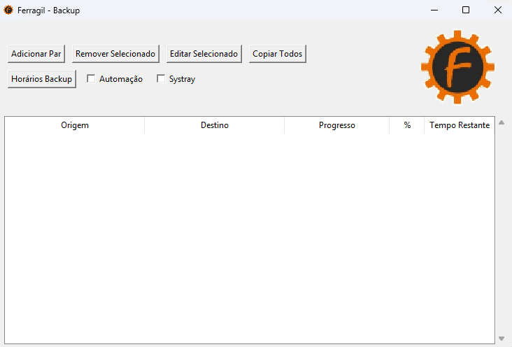

# FerragilBackup

This is a python software created to automatically (or manually) backup specified directories with user friendly GUI and with some copy/paste verification.

# Features
- It will only copy files from origin directory that have been edited or new files.
- automation (copy/paste) task runs everytime .exe is launched and everyday at 17:30 on windows clock
- systray function to hide from taskbar automation and systray combined = minimized auto start

# Support
For Windows 7 SP1, Windows 8, Windows 10, Windows 11

